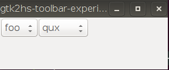
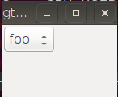

# Build and run

The [stack](https://docs.haskellstack.org/en/stable/README/) is the recommended way to build this project.

```
stack setup
stack build
stack exec gtk2hs-toolbar-experiment
```

# Description of the issue

The last command in the instructions opens a tiny GTK window. If you make it bigger, you'll see something like this:



But if you make it narrower a bit, the right `ComboBox` will disappear:



In the code I [enabled the show-arrow attribute](https://github.com/maoe/gtk2hs-toolbar-experiment/blob/f5e63f7d944d3d48cd04217dac39aad77091bac0/Gtk2Hs.hs#L23):

```haskell
    set toolbar [toolbarShowArrow := True]
```

Interestingly if I changed the contents of the `Toolber` from `ToolItem`s to `ToolButton`s for example, I get the overflow menu.

Also I tested this with 3 packages: `gtk` for GTK2, `gtk3` for GTK3, and `gi-gtk` for GTK3 with gobject introspection and all of them have the same issue.

Is it a GTK limitation and is there any workaround for it?
